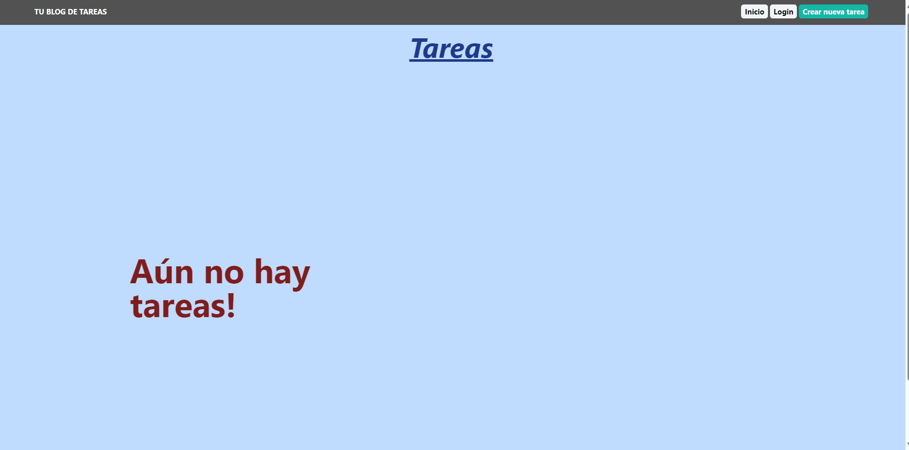
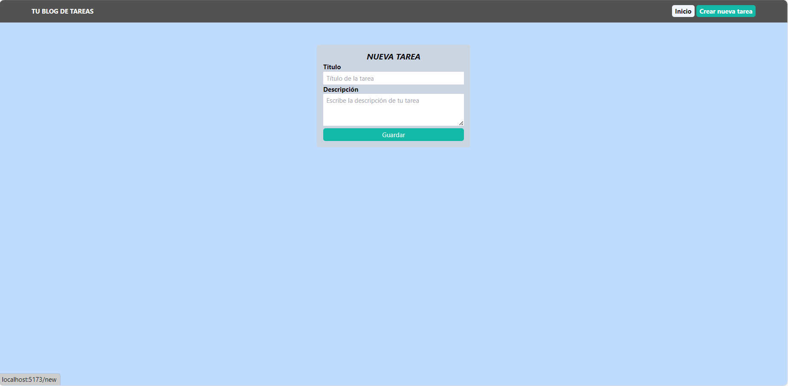
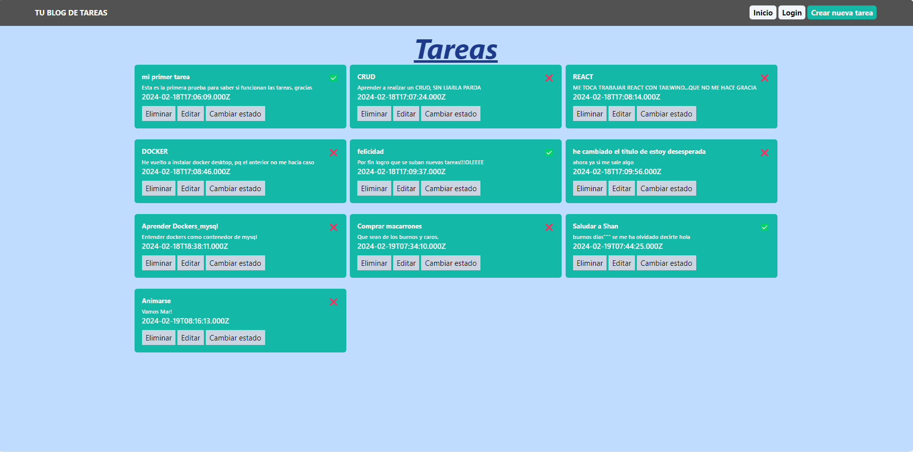
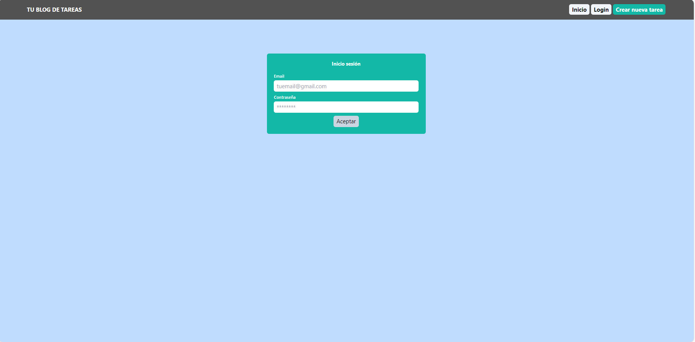
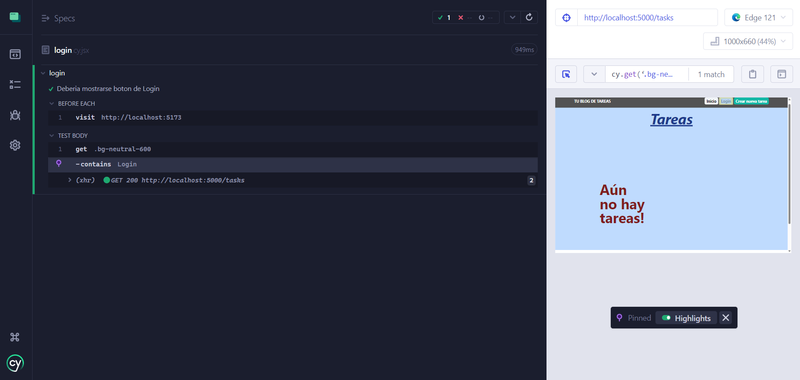
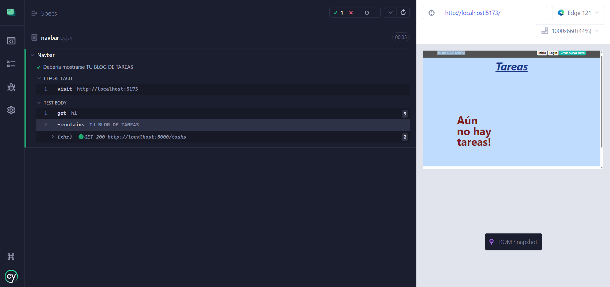
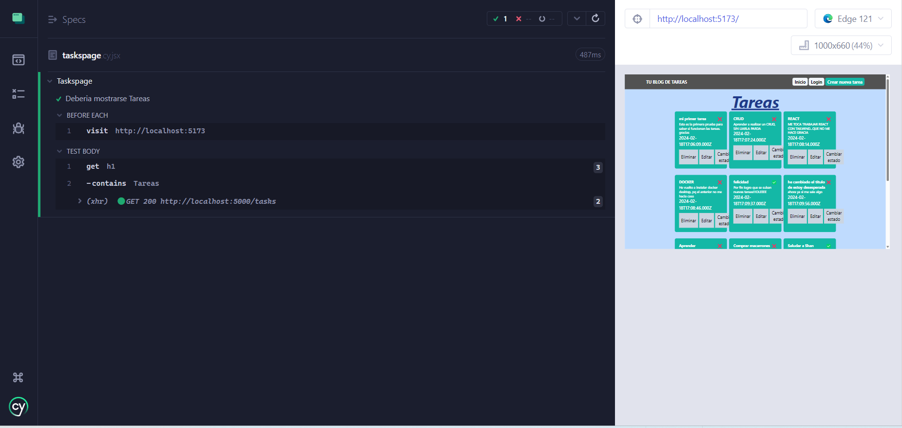

# Blog de las Tareas
Ejercicio para practicar CRUD (Create, Read, Update, Delete). Consta de una parte frontend y una parte backend (mysql incluida en docker). 
Es una APP donde podrás añadir las tareas de tu dia a dia, y cuando las acabes pueds añadir el "tick" de hecho...además se añade la fecha y la hora. 

## Característica Principales

Este blog de tareas, es más parecido a un to do list. Donde puedes indicar con un titulo y una descripcion que tareas tienes que realizar y que una vwz hechas, puedes marcarlas con un check. Cuenta con 3 botones, uno de Inico, un login y otro boton de crear tarea nueva. 

Cuando la aplicacion no está conectada la pagina de Inicio, muestra un mensaje de no hay tareas.

Para añadir una nueva tarea, al pinchar en el boton de crear una nueva tarea nos sale la siguiente pagina:

Según se van añadiendo nuevas tareas, se van acumulando en la pagina de inicio

Por otro lado, tenemos tambien un boton de loguin con validaciones

## Tecnologías Utilizadas 

- REACT
- JavaScript
- Json
- REACT 
- REACT (HOOKS)
- REACT ROUTER DOM
- DOCKER (MYSQL)
- TAILWIND
- NODE
- EXPRESS
- VITE

## Cómo Ejecutar

Para ejecutar este proyecto en tu máquina local, necesitas abrir dos consolas:

- Frontend. Client. 
- Backend. Server. Nodemon index
- Docker. 

- Un navegador web moderno.

## Instalacion

1- Clona el repositorio:

> git clone https://github.com/MarPrieto7/Task-CRUD.git

2- Intalar:

> npm install

3- Iniciar Proyecto:

> npm run dev (frontend_client)
> nodemon index (backend_server)
> docker desktop
> docker exec -it mymysql bash, mysql -u root --password, Enter password, docker run mysql, show databases, show tables

## Uso

*. Una vez que el proyecto esté en ejecución, podrás realizar diversas acciones:

- Navegar por la Página de Inicio. 

- Crear una nueva tarea

- Revisar las tareas, las cuales puedes crearlas, leerlas, actualizarlas e incluso eliminarlas

- Si has terminado de completar una tarea, al pinchar en el boton de Cambiar estado, puedes ponerle in "check" o bien dejarla sin terminar y figura un "aspa". 

*. Además, tendrás acceso a un formulario funcional:

- Formulario de Inicio de Sesión: Podrás acceder fácilmente a tu cuenta a través del formulario de inicio de sesión.

## Test Cypress

Se ha realizado 3 test con Cypress

- Un test para boton de login. Con resultado Pass.

- Un test para <h1>Blog de tareas. Con resultado Pass.
  

-- Un test para <h1>Tareas. Con resultado Pass.

## Desarrolladora

####Diseño e implementación: 

- Mar Prieto
